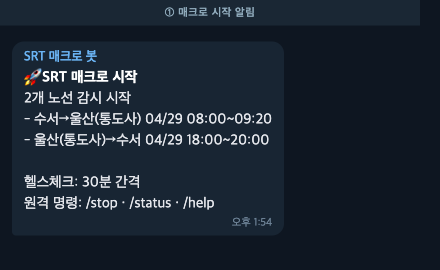
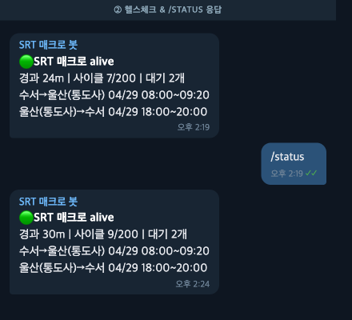
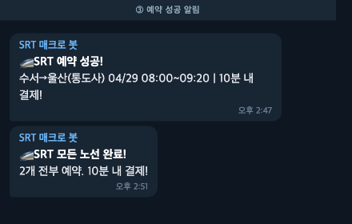
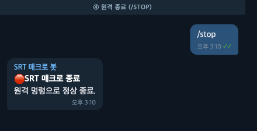
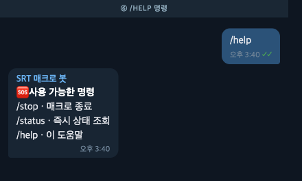

# srt-magic 설치 가이드

> 매진된 SRT 좌석을 자동 감시하다가 빈자리가 나면 즉시 예약하는 Claude Code 플러그인.

---

## 목차

1. [사전 요구사항](#1-사전-요구사항)
2. [플러그인 설치](#2-플러그인-설치)
3. [SRT 자격증명 등록](#3-srt-자격증명-등록)
4. [텔레그램 알림 설정 (선택)](#4-텔레그램-알림-설정-선택)
5. [첫 실행 — dry-run 검증](#5-첫-실행--dry-run-검증)
6. [실전 매크로 실행](#6-실전-매크로-실행)
7. [텔레그램 알림 종류](#7-텔레그램-알림-종류)
8. [진행 상황 확인 & 중단](#8-진행-상황-확인--중단)
9. [역명 함정 주의사항](#9-역명-함정-주의사항)
10. [안전 가드 설명](#10-안전-가드-설명)
11. [트러블슈팅](#11-트러블슈팅)
12. [완전 제거](#12-완전-제거)

---

## 1. 사전 요구사항

| 항목 | 요구 |
|------|------|
| OS | macOS / Windows / Linux |
| Python | 3.10 이상 |
| SRT 계정 | [etk.srail.or.kr](https://etk.srail.or.kr) 회원가입 필수 |
| Claude Code | 마켓플레이스 지원 버전 |
| (선택) 텔레그램 | 푸시 알림 + 원격 종료 받으려면 |

---

## 2. 플러그인 설치

Claude Code에서 마켓플레이스를 등록하고 플러그인을 설치합니다.

**Step 1: 마켓플레이스 등록** (최초 1회)

```
/plugin marketplace add brandonnoh/woojoo-magic
```

**Step 2: 플러그인 설치**

```
/plugin install wj-magic@woojoo-magic
/plugin install srt-magic@woojoo-magic
```

또는 대화형으로: `/plugin` → Discover 탭 → 플러그인 선택 → Install

**Step 3: 활성화 확인**

```
/reload-plugins
/plugin          # → Installed 탭에서 확인
```

---

## 3. SRT 자격증명 등록

### Claude Code에서 대화형 셋업 (권장)

Claude Code에서 자연어로 요청하면 대화를 통해 자격증명을 등록할 수 있습니다.

```
SRT 셋업해줘
```

Claude가 대화로 안내하는 것:

1. SRT 회원번호(ID) 입력
2. 비밀번호 입력
3. 텔레그램 봇 토큰 입력 (선택)
4. `~/.config/srt-macro/.env` 파일 자동 생성 (chmod 0600)

### 터미널에서 직접 셋업 (Claude 없이)

Claude Code 밖에서 설정하고 싶으면 대화형 스크립트를 실행합니다.

```bash
! python3 ~/.claude/plugins/marketplaces/woojoo-magic/src/srt-magic/skills/srt-macro/scripts/setup.py
```

비밀번호는 `getpass`로 화면에 표시되지 않고, 재입력 확인 후 저장됩니다.

> 기존 `.env`가 있으면 덮어쓰기 전 확인하고 `.env.backup`으로 자동 백업합니다.

### 수동 설정

직접 `.env` 파일을 만들려면:

```bash
mkdir -p ~/.config/srt-macro
cat > ~/.config/srt-macro/.env << 'EOF'
KSKILL_SRT_ID=여기에_SRT_회원번호
KSKILL_SRT_PASSWORD=여기에_비밀번호
SRT_MACRO_MAX_ATTEMPTS=200
SRT_MACRO_MAX_DURATION_SEC=14400
SRT_MACRO_SEARCH_TIMEOUT_SEC=30
SRT_MACRO_HEALTHCHECK_MIN=30
SRT_MACRO_NOTIFY_SOUND=Glass
SRT_MACRO_TELEGRAM_TOKEN=
SRT_MACRO_TELEGRAM_CHAT_ID=
EOF
chmod 600 ~/.config/srt-macro/.env
```

### 자격증명 우선순위

1. **환경변수** (`KSKILL_SRT_ID`, `KSKILL_SRT_PASSWORD`) — CI/일회성 override
2. **`.env` 파일** — 평상시 사용
3. **macOS Keychain** — fallback (macOS만 해당)

---

## 4. 텔레그램 알림 설정 (선택)

외출 중에도 휴대폰으로 예약 성공 알림을 받고, `/stop`으로 원격 종료할 수 있습니다.

### Step 1: 봇 생성

1. 텔레그램에서 **@BotFather** 검색
2. `/newbot` → 봇 이름 지정 → **토큰** 복사
3. `.env`의 `SRT_MACRO_TELEGRAM_TOKEN`에 붙여넣기

### Step 2: chat_id 등록

1. 생성한 봇과 대화 시작 (`/start` 전송)
2. Claude Code에서: `텔레그램 chat_id 등록해줘` 또는 터미널에서 헬퍼 실행:

```bash
! python3 ~/.claude/plugins/marketplaces/woojoo-magic/src/srt-magic/skills/srt-macro/scripts/setup_telegram.py
```

3. chat_id가 자동 추출되어 `.env`에 기록됨
4. 테스트 메시지가 텔레그램으로 도착하면 성공

---

## 5. 첫 실행 — dry-run 검증

실제 예약 없이 검색만 테스트:

```bash
python3 ~/.claude/plugins/marketplaces/woojoo-magic/src/srt-magic/skills/srt-macro/scripts/srt_watcher.py \
  --dep 수서 --arr 부산 --date 20260501 \
  --time-from 080000 --time-to 120000 --dry-run
```

- 첫 실행이면 venv가 자동 셋업됨 (~30초)
- 자리가 있으면 발견 즉시 종료 (예약 X)
- 매진이면 1 사이클 후 종료

> dry-run이 정상 작동하면 실전 실행 준비 완료.

---

## 6. 실전 매크로 실행

### Claude Code에서 (권장)

```
SRT 수서→울산(통도사) 4/29 08시~09시20분 매진 잡아줘
```

Claude가 자동으로 srt-macro 스킬을 트리거합니다.

### 단일 노선 — 터미널에서 직접

```bash
nohup python3 ~/.claude/plugins/marketplaces/woojoo-magic/src/srt-magic/skills/srt-macro/scripts/srt_watcher.py \
  --dep '수서' --arr '울산(통도사)' --date 20260429 \
  --time-from 080000 --time-to 092000 --seat general \
  > ~/srt-macro.log 2>&1 &

echo "PID: $!"
```

### 왕복 (다중 노선 동시 감시)

```bash
nohup python3 ~/.claude/plugins/marketplaces/woojoo-magic/src/srt-magic/skills/srt-macro/scripts/srt_watcher.py \
  --route '수서:울산(통도사):20260429:080000:092000:general' \
  --route '울산(통도사):수서:20260429:180000:200000:general' \
  > ~/srt-macro.log 2>&1 &

echo "PID: $!"
```

> `--route`를 더 붙이면 3개, 4개 노선도 동시 감시 가능.
> 한 프로세스 / 1회 로그인이므로 **계정 안전**.

### 인자 설명

| 인자 | 설명 | 예시 |
|------|------|------|
| `--dep` | 출발역 | `수서` |
| `--arr` | 도착역 | `울산(통도사)` |
| `--date` | 날짜 (YYYYMMDD) | `20260429` |
| `--time-from` | 희망 출발 시각 (HHMMSS) | `080000` |
| `--time-to` | 시간 상한 (선택) | `092000` |
| `--seat` | 좌석 선호 | `general` / `special` / `both` |
| `--route` | 다중 노선 (반복) | `'dep:arr:date:from[:to[:seat]]'` |
| `--dry-run` | 검색만, 예약 안 함 | |

---

## 7. 텔레그램 알림 종류

텔레그램 토큰과 chat_id가 설정되어 있으면 아래 알림이 자동 발송됩니다.

### 매크로 시작

매크로 실행 시 감시 노선 목록, 헬스체크 간격, 원격 명령 안내를 전송합니다.

<p align="center">
  
</p>

### 헬스체크 & /status

30분마다 자동 헬스체크를 보내고, `/status` 명령으로 즉시 상태를 조회할 수도 있습니다.

<p align="center">
  
</p>

### 예약 성공

좌석을 잡으면 즉시 알림. **10분 내 SRT 앱에서 결제**해야 합니다 (자동 결제 X).

<p align="center">
  
</p>

### 원격 종료 (/stop)

외출 중 매크로를 멈추고 싶으면 봇에게 `/stop` 전송. 1~2분 안에 정상 종료됩니다.

<p align="center">
  
</p>

### 에러 종료

연속 5회 API 에러 발생 시 계정 보호를 위해 자동 종료됩니다.

<p align="center">
  
</p>

### /help 명령

사용 가능한 텔레그램 명령 목록을 확인합니다.

<p align="center">
  
</p>

### 명령 요약

| 명령 | 동작 |
|------|------|
| `/stop` (또는 `/kill`, `/abort`, `/exit`, `/quit`) | 매크로 종료 |
| `/status` | 즉시 상태 조회 |
| `/help` | 명령 목록 |

> 본인 chat_id에서 보낸 메시지만 인식합니다. 다른 사람이 명령을 보내도 무시됩니다.

---

## 8. 진행 상황 확인 & 중단

### 로그 보기

```bash
tail -f ~/srt-macro.log
```

`Ctrl+C`로 tail만 빠져나옴 (매크로는 계속 실행).

### 매크로 중단

**텔레그램 (권장):** 봇에게 `/stop` 전송

**터미널:**

```bash
pkill -f srt_watcher.py && rm -f ~/.srt-macro.lock
```

---

## 9. 역명 함정 주의사항

SRT 역명은 정확히 입력해야 합니다. 흔히 부르는 이름과 실제 이름이 다릅니다:

| 잘못된 입력 | 올바른 입력 |
|------------|-----------|
| 울산 | `울산(통도사)` |
| 구미 | `김천(구미)` |
| 여수 | `여수EXPO` |

### 전체 허용 역명 (33개)

```
수서, 동탄, 평택지제, 천안아산, 오송, 대전, 김천(구미),
동대구, 서대구, 신경주, 경주, 울산(통도사), 부산,
포항, 밀양, 진영, 창원중앙, 창원, 마산, 진주,
공주, 익산, 정읍, 광주송정, 나주, 목포,
전주, 남원, 곡성, 구례구, 순천, 여천, 여수EXPO
```

> 잘못된 역명 입력 시 해당 노선만 영구 제외되고 다른 노선은 계속 감시합니다.

---

## 10. 안전 가드 설명

SRT 계정 잠김을 방지하기 위해 8중 안전 장치가 내장되어 있습니다.

| 레이어 | 정책 |
|--------|------|
| **세션 재사용** | 시작 시 1회 로그인, 이후 `search_train`만 반복 |
| **폴링 간격 지터** | 골든타임(7~10/18~21시) 30~60초, 평시 60~120초, 야간(0~6시) 5~10분 |
| **시도 캡** | 200회 또는 4시간 (둘 중 빠른 것) → 자동 종료 |
| **로그인 실패** | 즉시 종료. 재시도 절대 안 함 (3회면 SRT 계정 잠김) |
| **NetFunnel 혼잡** | 서버 대기열 혼잡은 일시적 에러로 분류, 30~60초 후 재시도 |
| **에러 백오프** | 2분 → 5분 → 15분 지수 증가, 5회 연속 실패 시 종료 |
| **세션 만료** | 자동 재로그인 1회 시도 |
| **단일 인스턴스** | `~/.srt-macro.lock`으로 중복 실행 차단 |
| **예약 후 즉시 종료** | 1좌석 잡히면 해당 노선 폴링 중단 |
| **결제 자동화 안 함** | 10분 내 사용자가 SRT 앱에서 직접 결제 |

### 환경변수로 조정 가능한 값

| 변수 | 기본값 | 설명 |
|------|--------|------|
| `SRT_MACRO_MAX_ATTEMPTS` | 200 | 최대 폴링 사이클 수 |
| `SRT_MACRO_MAX_DURATION_SEC` | 14400 (4시간) | 최대 실행 시간 |
| `SRT_MACRO_SEARCH_TIMEOUT_SEC` | 30 | 검색 API 타임아웃 |
| `SRT_MACRO_HEALTHCHECK_MIN` | 30 | 헬스체크 간격 (0이면 비활성) |

---

## 11. 트러블슈팅

### 로그인 실패

```
❌ 로그인 실패. 비밀번호 확인 후 재등록. 재시도 안 함
```

→ `.env`의 `KSKILL_SRT_ID`/`KSKILL_SRT_PASSWORD` 확인. SRT 사이트에서 직접 로그인 테스트.

### lockfile 존재

```
❌ 이미 실행 중. PID 확인 후 ~/.srt-macro.lock 삭제.
```

→ 이미 실행 중이거나 비정상 종료.

```bash
cat ~/.srt-macro.lock        # PID 확인
ps -p $(cat ~/.srt-macro.lock)  # 살아있는지 확인
rm -f ~/.srt-macro.lock      # 죽었으면 정리
```

### 연속 사이클 실패

```
❌ 연속 사이클 실패 5회. 안전 종료.
```

→ SRT 서버 점검이거나 일시적 장애. **30분 이상 대기** 후 재시도.

### 역명 에러

```
❌ [수서→울산 ...] 입력 오류 (영구 제외)
```

→ 정확한 역명 사용. [9. 역명 함정 주의사항](#9-역명-함정-주의사항) 참고.

### venv 셋업 실패

→ 시스템 python에 venv 모듈이 없을 수 있음:

```bash
python3 -m venv --help  # 정상이면 도움말 출력
```

---

## 12. 완전 제거

```bash
# 플러그인 제거 (Claude Code에서)
# 플러그인 제거
/plugin uninstall srt-magic@woojoo-magic

# 설정·자격증명·venv (~50MB)
rm -rf ~/.config/srt-macro

# macOS Keychain fallback (있으면)
security delete-generic-password -a "$USER" -s KSKILL_SRT_ID 2>/dev/null
security delete-generic-password -a "$USER" -s KSKILL_SRT_PASSWORD 2>/dev/null

# 로그·lockfile
rm -f ~/srt-macro.log ~/.srt-macro.lock
```

---

## 좌석 잡히면?

1. macOS 알림 + 시스템 사운드 (Windows: toast, Linux: notify-send)
2. 텔레그램 푸시 (설정했으면)
3. 로그에 예약번호·구입기한 출력
4. **SRT 앱/사이트에서 10분 내 결제** (필수)
5. 매크로 자동 종료

> `~/srt-macro.log`에 예약번호가 남습니다. 민감하면 끝나고 `rm ~/srt-macro.log`.
