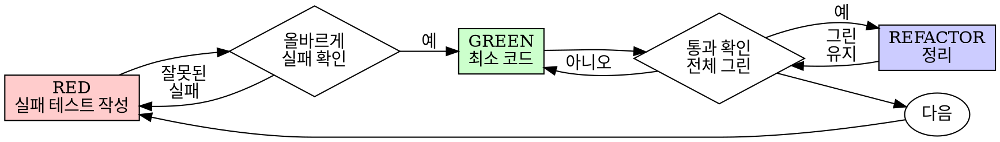

# 테스트 주도 개발 (TDD)

## 개요

테스트를 먼저 작성한다. 실패를 확인한다. 통과하는 최소한의 코드를 작성한다.

**핵심 원칙:** 테스트가 실패하는 것을 보지 않았다면, 그것이 올바른 것을 테스트하는지 알 수 없다.

**규칙의 문자를 위반하는 것은 규칙의 정신을 위반하는 것이다.**

## 언제 사용하나

**항상:**
- 새 기능
- 버그 수정
- 리팩토링
- 동작 변경

**예외 (사용자에게 확인):**
- 일회용 프로토타입
- 생성된 코드
- 설정 파일

"이번만 TDD 건너뛰자"라는 생각? 멈춰라. 그것은 합리화다.

## 철칙

```
실패하는 테스트 없이 프로덕션 코드 작성 금지
```

테스트 전에 코드를 작성했나? 삭제하라. 처음부터 다시.

**예외 없음:**
- "참고용"으로 남기지 않기
- 테스트를 작성하면서 "적응"시키지 않기
- 보지 않기
- 삭제는 삭제

테스트로부터 새로 구현한다. 마침표.

## Red-Green-Refactor



### RED - 실패하는 테스트 작성

무엇이 일어나야 하는지 보여주는 최소한의 테스트 하나를 작성한다.

<Good>
```typescript
test('실패한 작업을 3회 재시도한다', async () => {
  let attempts = 0;
  const operation = () => {
    attempts++;
    if (attempts < 3) throw new Error('fail');
    return 'success';
  };

  const result = await retryOperation(operation);

  expect(result).toBe('success');
  expect(attempts).toBe(3);
});
```
명확한 이름, 실제 동작 테스트, 한 가지만
</Good>

<Bad>
```typescript
test('재시도 작동', async () => {
  const mock = jest.fn()
    .mockRejectedValueOnce(new Error())
    .mockRejectedValueOnce(new Error())
    .mockResolvedValueOnce('success');
  await retryOperation(mock);
  expect(mock).toHaveBeenCalledTimes(3);
});
```
모호한 이름, 코드가 아닌 mock을 테스트
</Bad>

**요구사항:**
- 하나의 동작
- 명확한 이름
- 실제 코드 (불가피한 경우를 제외하고 mock 사용 안 함)

### RED 검증 - 실패를 확인

**필수. 절대 건너뛰지 않기.**

```bash
npm test path/to/test.test.ts
```

확인:
- 테스트가 실패한다 (에러가 아님)
- 실패 메시지가 예상한 것이다
- 기능이 없어서 실패한다 (오타가 아님)

**테스트가 통과하나?** 기존 동작을 테스트하고 있다. 테스트를 수정.

**테스트가 에러나나?** 에러를 수정하고, 올바르게 실패할 때까지 재실행.

### GREEN - 최소한의 코드

테스트를 통과하는 가장 간단한 코드를 작성한다.

<Good>
```typescript
async function retryOperation<T>(fn: () => Promise<T>): Promise<T> {
  for (let i = 0; i < 3; i++) {
    try {
      return await fn();
    } catch (e) {
      if (i === 2) throw e;
    }
  }
  throw new Error('unreachable');
}
```
통과에 필요한 만큼만
</Good>

<Bad>
```typescript
async function retryOperation<T>(
  fn: () => Promise<T>,
  options?: {
    maxRetries?: number;
    backoff?: 'linear' | 'exponential';
    onRetry?: (attempt: number) => void;
  }
): Promise<T> {
  // YAGNI
}
```
과도한 설계
</Bad>

기능을 추가하거나, 다른 코드를 리팩토링하거나, 테스트 범위를 넘어 "개선"하지 않는다.

### GREEN 검증 - 통과를 확인

**필수.**

```bash
npm test path/to/test.test.ts
```

확인:
- 테스트가 통과한다
- 다른 테스트도 여전히 통과한다
- 출력이 깔끔하다 (에러, 경고 없음)

**테스트가 실패하나?** 코드를 수정, 테스트를 수정하지 않는다.

**다른 테스트가 실패하나?** 지금 수정한다.

### REFACTOR - 정리

그린 이후에만:
- 중복 제거
- 이름 개선
- 헬퍼 추출

테스트를 그린으로 유지. 동작을 추가하지 않는다.

### 반복

다음 기능을 위한 다음 실패 테스트.

## 좋은 테스트

| 품질 | 좋은 것 | 나쁜 것 |
|------|--------|---------|
| **최소** | 한 가지. 이름에 "and"가 있나? 분리. | `test('이메일과 도메인과 공백을 검증한다')` |
| **명확** | 이름이 동작을 설명 | `test('test1')` |
| **의도 표현** | 원하는 API를 보여줌 | 코드가 무엇을 해야 하는지 불명확 |

## 순서가 중요한 이유

**"나중에 테스트를 작성해서 확인하겠다"**

코드 이후에 작성된 테스트는 즉시 통과한다. 즉시 통과는 아무것도 증명하지 않는다:
- 잘못된 것을 테스트할 수 있다
- 동작이 아닌 구현을 테스트할 수 있다
- 잊은 엣지 케이스를 놓칠 수 있다
- 버그를 잡는 것을 본 적이 없다

테스트를 먼저 작성하면 실패를 보게 되어, 실제로 무언가를 테스트한다는 것을 증명한다.

**"이미 모든 엣지 케이스를 수동으로 테스트했다"**

수동 테스트는 즉흥적이다. 모든 것을 테스트했다고 생각하지만:
- 무엇을 테스트했는지 기록이 없다
- 코드가 변경되면 재실행할 수 없다
- 압박 속에서 케이스를 잊기 쉽다
- "해봤을 때 작동했어" != 포괄적

자동화 테스트는 체계적이다. 매번 같은 방식으로 실행된다.

**"X시간의 작업을 삭제하는 건 낭비다"**

매몰 비용 오류. 시간은 이미 지났다. 지금의 선택:
- 삭제하고 TDD로 재작성 (X시간 더, 높은 신뢰도)
- 유지하고 나중에 테스트 추가 (30분, 낮은 신뢰도, 버그 가능성)

"낭비"는 신뢰할 수 없는 코드를 유지하는 것이다. 진정한 테스트 없는 작동 코드는 기술 부채다.

**"TDD는 교조적, 실용적이 되는 것이 적응"**

TDD가 실용적이다:
- 커밋 전에 버그 발견 (나중에 디버깅보다 빠름)
- 회귀 방지 (테스트가 즉시 파손을 감지)
- 동작 문서화 (테스트가 사용 방법을 보여줌)
- 리팩토링 지원 (자유롭게 변경, 테스트가 파손 감지)

"실용적" 지름길 = 프로덕션 디버깅 = 더 느림.

**"나중에 테스트해도 같은 목표를 달성한다 -- 형식이 아니라 정신"**

아니다. 테스트-이후는 "이것이 무엇을 하나?"에 답한다. 테스트-먼저는 "이것이 무엇을 해야 하나?"에 답한다.

테스트-이후는 구현에 편향된다. 만든 것을 테스트하지, 요구된 것을 테스트하지 않는다. 기억하는 엣지 케이스를 검증하지, 발견한 것을 검증하지 않는다.

테스트-먼저는 구현 전에 엣지 케이스 발견을 강제한다. 테스트-이후는 모든 것을 기억했는지 검증한다 (기억하지 못했다).

30분의 테스트-이후 != TDD. 커버리지는 얻지만 테스트가 작동한다는 증명을 잃는다.

## 흔한 합리화

| 핑계 | 현실 |
|------|------|
| "너무 단순해서 테스트 불필요" | 단순한 코드도 깨진다. 테스트 작성은 30초. |
| "나중에 테스트하겠다" | 즉시 통과하는 테스트는 아무것도 증명하지 않는다. |
| "나중에 테스트해도 같은 목표 달성" | 테스트-이후 = "이것이 뭐하지?" 테스트-먼저 = "이것이 뭘 해야 하지?" |
| "이미 수동으로 테스트했다" | 즉흥 != 체계적. 기록 없음, 재실행 불가. |
| "X시간 삭제는 낭비" | 매몰 비용 오류. 검증되지 않은 코드를 유지하는 것이 기술 부채. |
| "참고용으로 남기고 테스트 먼저" | 적응시킬 것이다. 그것은 테스트-이후. 삭제는 삭제. |
| "먼저 탐색이 필요해" | 좋다. 탐색을 버리고, TDD로 시작하라. |
| "테스트가 어려워 = 설계가 불명확" | 테스트에 귀 기울여라. 테스트하기 어려움 = 사용하기 어려움. |
| "TDD가 나를 느리게 한다" | TDD가 디버깅보다 빠르다. 실용적 = 테스트 먼저. |
| "수동 테스트가 더 빨라" | 수동은 엣지 케이스를 증명하지 않는다. 매번 변경마다 재테스트해야 한다. |
| "기존 코드에 테스트가 없어" | 개선하고 있다. 기존 코드에 테스트를 추가하라. |

## 위험 신호 - 중단하고 처음부터

- 테스트 전에 코드
- 구현 이후에 테스트
- 테스트가 즉시 통과
- 왜 테스트가 실패했는지 설명 못 함
- "나중에" 추가하는 테스트
- "이번만" 합리화
- "이미 수동으로 테스트했다"
- "테스트-이후도 같은 목적을 달성한다"
- "형식이 아니라 정신이 중요해"
- "참고용으로 남겨" 또는 "기존 코드를 적응시켜"
- "이미 X시간 투자했는데, 삭제는 낭비"
- "TDD는 교조적, 나는 실용적"
- "이건 달라서..."

**이 모두가 의미하는 것: 코드를 삭제하라. TDD로 처음부터.**

## 예시: 버그 수정

**버그:** 빈 이메일이 허용됨

**RED**
```typescript
test('빈 이메일을 거부한다', async () => {
  const result = await submitForm({ email: '' });
  expect(result.error).toBe('Email required');
});
```

**RED 검증**
```bash
$ npm test
FAIL: expected 'Email required', got undefined
```

**GREEN**
```typescript
function submitForm(data: FormData) {
  if (!data.email?.trim()) {
    return { error: 'Email required' };
  }
  // ...
}
```

**GREEN 검증**
```bash
$ npm test
PASS
```

**REFACTOR**
여러 필드에 대한 유효성 검사가 필요하면 추출.

## 검증 체크리스트

작업 완료 표시 전에:

- [ ] 모든 새 함수/메서드에 테스트가 있다
- [ ] 각 테스트가 구현 전에 실패하는 것을 확인했다
- [ ] 각 테스트가 예상된 이유로 실패했다 (기능 없음, 오타가 아님)
- [ ] 각 테스트를 통과하는 최소한의 코드를 작성했다
- [ ] 모든 테스트가 통과한다
- [ ] 출력이 깔끔하다 (에러, 경고 없음)
- [ ] 테스트가 실제 코드를 사용한다 (불가피한 경우에만 mock)
- [ ] 엣지 케이스와 에러가 커버된다

모든 체크박스를 체크할 수 없나? TDD를 건너뛴 것이다. 처음부터.

## 막혔을 때

| 문제 | 해결 |
|------|------|
| 테스트 방법을 모르겠다 | 원하는 API를 작성. assertion을 먼저 작성. 사용자에게 물어보기. |
| 테스트가 너무 복잡 | 설계가 너무 복잡. 인터페이스를 단순화. |
| 모든 것을 mock해야 한다 | 코드가 너무 결합됨. 의존성 주입 사용. |
| 테스트 셋업이 거대 | 헬퍼 추출. 여전히 복잡하면? 설계를 단순화. |

## 디버깅 통합

버그 발견? 재현하는 실패 테스트를 작성. TDD 사이클을 따른다. 테스트가 수정을 증명하고 회귀를 방지한다.

테스트 없이 버그를 수정하지 않는다.

## 테스트 안티패턴

mock이나 테스트 유틸리티를 추가할 때 흔한 함정에 주의:
- 실제 동작이 아닌 mock 동작 테스트
- 프로덕션 클래스에 테스트 전용 메서드 추가
- 의존성을 이해하지 않고 mock

## 최종 규칙

```
프로덕션 코드 -> 테스트가 존재하고 먼저 실패해야 한다
그 외 -> TDD가 아니다
```

사용자의 허락 없이 예외 없음.
